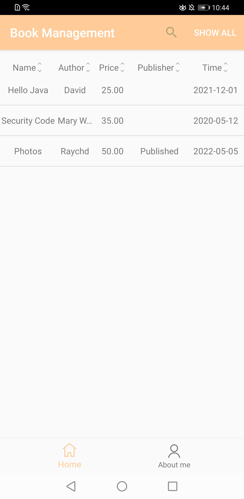

# CloudDB QuickStart

## Introduction
It's a quickstart sample demonstrating the CloudDB APIs on iOS. 

## Getting Started
- Open this project by Xcode.

- Go to [AppGallery Connect page](https://developer.huawei.com/consumer/cn/service/josp/agc/index.html#/myApp) to create your new application. 

- Click **Auth Service** on the navigation bar and enable authentication using an anonymous account.

- Click **Cloud DB** on the navigation bar and enable database service. Then, perform the following operations:

  (1) Create a schema by importing a template file stored in **CloudDBQuickStart_1.json** in the root directory of the project. Alternatively, create a schema named **BookInfo** and ensure that all fields must be the same as those in **BookInfo.h** in the project.

  (2) Create a Cloud DB zone. On the **Cloud DB Zone** tab page, click **Add** to create a Cloud DB zone named **QuickStartDemo**.

- Download agconnect-services.plist from **Generate view** tab, and add it under app directory.

- Modify the bundleId of the current Xcode project configuration to the content corresponding to the packageName in the above "agconnect-services.plist" file

- Before starting the operation, the pod install operation needs to be executed to associate the relevant libraries.

- Run the sample on iOS device. 

## Result

## License

CloudDB QuickStart is licensed under the [Apache License, version 2.0](http://www.apache.org/licenses/LICENSE-2.0).
